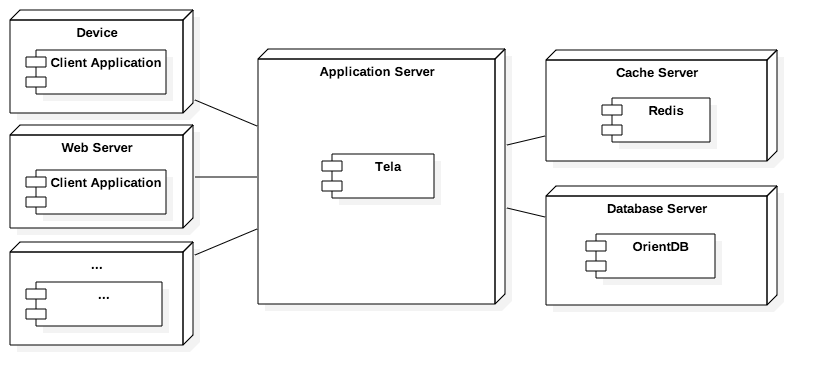

# Tela Deployment: Building, Configuring, Packaging and Running Tela

This document covers the process of building, configuring, packaging and running Tela.

## Building your own Tela Server

The Tela Framework contains a server already configured with two modules (Instagram & Twitter), which can be started by running the `main` method at `io.reneses.tela.App`.

In case we would like to register different modules, or integrate Tela within an existing app, the process is quite straighforward. First, we have to import the `TelaServer` and the `Assembler`:

```java
import io.reneses.tela.Assembler;
import io.reneses.tela.core.api.server.TelaServer;
```

The `Assembler` is the component responsible of reading the configuration, configuring and injecting the rest of components and instantiating the server. Although its usage is not required as this process can be done manually, it is quite advisable to use it.

Then, whe import the modules we will register:

```java
import io.reneses.tela.modules.instagram.InstagramTelaModule;
import io.reneses.tela.modules.twitter.TwitterTelaModule;
```

Finally, we build the server, passing the modules as parameters to the `build` method...

```java
TelaServer tela = Assembler.build(
    new InstagramTelaModule(),
    new TwitterTelaModule()
 );
```

... and call `start()` on the retrieved instance:

```
tela.start();
```

## Configuring Tela

Tela can be configured in the following ways (from higher to lower priority):

1. Programmatically
2. Setting the properties as system environmental variables
3. Setting the properties in the `tela.properties` file
4. If it is not present neither, it uses the default option

If any configuration is present, Tela will use the default value.

### Programmatically Configuration

The `Assembler.build()` method also admits a `Configuration` instance, which can be use in order to set properties programmatically. For example:

```java
import io.reneses.tela.Assembler;
import io.reneses.tela.core.api.server.TelaServer;
import io.reneses.tela.core.configuration.Configuration;
import io.reneses.tela.core.configuration.ConfigurationFactory;
import io.reneses.tela.modules.twitter.TwitterTelaModule;

public class App {

    public static void main(String[] args) {

        Configuration config = ConfigurationFactory.create();
        config.setProperty(Configuration.Property.CACHE_TTL, 1000);
        config.setProperty(Configuration.Property.PORT, 80);

        TelaServer tela = Assembler.build(config, new TwitterTelaModule());
        tela.start();
    }
}

```

### Using Environmental Variables

The process of setting environmental variables depends on the Operating System. A tutorial for OS X, Windows and Mac can be found at [this link](https://www.schrodinger.com/kb/1842) (Schrodinger.com).

### Using File Configuration

The `tela.properties` file is a [standard Properties java text file](https://docs.oracle.com/javase/8/docs/api/java/util/Properties.html), which should be placed within the same folder than the Jar distribution. Its syntax is: `[KEY]=[VALUE]`, for example:

```
# General
port=8080
scheduler.delay=300

# Cache
cache.mode=memory
cache.ttl=3600
```

### Configuration options

The available options, as well as their environmental properties, keys within the properties file, and default values can be found in the following table:

Option            | Default value | Env property      | File property     | Description
:----------------:|:-------------:|:-----------------:|:-----------------:|:------------:
Tela port         | 80            | PORT              | port              | Port Tela will be binded to
Scheduler delay   | 300           | SCHEDULER_DELAY   | scheduler.delay   | Delay for the scheduler
Cache TTL         | 3600          | CACHE_TTL         | cache.ttl         | TTL of the cache &history entries
Cache mode        | memory        | CACHE_MODE        | cache.mode        | Cache mode (memory or redis)
Redis host        | localhost     | REDIS_HOST        | redis.host        | Redis host
Redis port        | 6379          | REDIS_PORT        | redis.port        | Redis port
Redis user        | null          | REDIS_USER        | redis.user        | Redis user
Redis password    | null          | REDIS_PASSWORD    | redis.password    | Redis password
OrientDB mode     | local         | ORIENTDB_MODE     | orientdb.mode     | [OrientDB storage](http://orientdb.com/docs/master/Storages.html)
OrientDB local    | ./data        | ORIENTDB_LOCAL    | orientdb.local    | DB folder (local mode)
OrientDB host     | localhost     | ORIENTDB_HOST     | orientdb.host     | DB host (remote mode)
OrientDB port     | 2424          | ORIENTDB_PORT     | orientdb.port     | DB port (remote mode)
OrientDB database | Tela          | ORIENTDB_DATABASE | orientdb.database | DB database (memory/remote mode)
OrientDB user     | root          | ORIENTDB_USER     | orientdb.user     | OrientDB user
OrientDB password | root          | ORIENTDB_PASSWORD | orientdb.password | OrientDB user


## Compiling, Packaging & Installing Tela

Tela uses **[Maven](https://maven.apache.org/)** as build automation tool. Therefore, it can be compiled and packaged executing the `package` goal (or `install` if we also want to install Tela at our local Maven repository). If we want a faster build, tests can be skipped with the `-DskipTests=true` option:

```bash
# Execute tests and package Tela
mvn clean package

# Package Tela skipping tests
mvn clean package -DskipTests=true

# Package & install Tela
mvn clean install -DskipTests=true
```

## Running Tela

At this point, you should already have a `tela.jar` file (and, optionally a `tela.properties` file), by default located at the folder `target/jar`.

### Docker

The easies way to run **Tela** is by using [**Docker**](https://www.docker.com). Both the `Dockerfile` and `docker-compose.yml` are included in the project, so running it is as easy as:

```
cmd /path/to/Tela
docker-compose up
```

The provided `Dockerfile` is already configured to use Redis and a remote OrientDB connection:

```bash
# Application port
ENV PORT 80
EXPOSE 80

# Configure redis
ENV CACHE_MODE redis
ENV REDIS_HOST redis
ENV REDIS_PORT 6379

# Configure OrientDB
ENV ORIENTDB_MODE remote
ENV ORIENTDB_HOST orientdb
ENV ORIENTDB_PORT 2480
ENV ORIENTDB_USER root
ENV ORIENTDB_PASSWORD tela
EXPOSE 2480
```

If other configuration is needed, the environmental variables can be changed by using the [Dockerfile syntax](https://docs.docker.com/engine/reference/builder/).


### Heroku

A Heroku's `Procfile` is provied with Tela, and the framework uses the `PORT` environmental variable as [Heroku requires](https://devcenter.heroku.com/articles/runtime-principles#web-servers). Therefore, the deployment on Heroku is straightforward. For example, if [Git deployment is configured](https://devcenter.heroku.com/articles/git), it can be done executing:

```
git push heroku
```

For Heroku deployment, the easiest way to configure Tela is using environmental variables. A `.env` file is provided too, so [Heroku Local](https://devcenter.heroku.com/articles/heroku-local) can easily be configured by modificating its contents, and executed locally with:

```
heroku local
```

### Console execution

If neither **Docker** or **Heroku** are installed, or you want to execute Tela directly, it can be done by executing:

```
java [JVM configuration] -jar path/to/tela.jar
```

Or

```
./scripts/run.sh
```

## Production Deployment

Tela can be configured to run all its components on memory:

```
CACHE_MODE=memory
ORIENTDB_MODE=memory
```

This is the simplest and most straightforward configuration. However, it implies performance and scalability drawbacks.

For production environments, the suggested deployment architecture is:

```bash
CACHE_MODE=redis
# ... Redis configuration
ORIENTDB_MODE=remote
# ... OrientDB configuration
```



